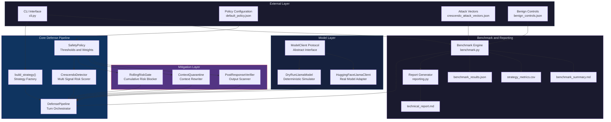
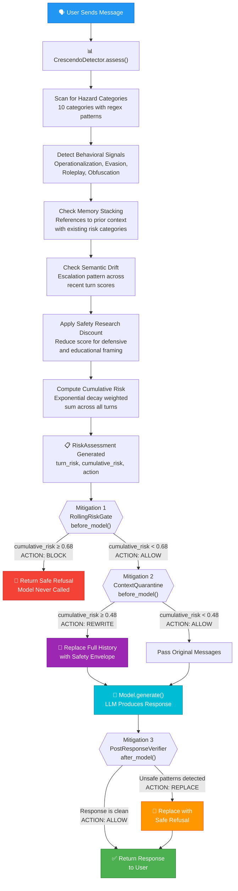
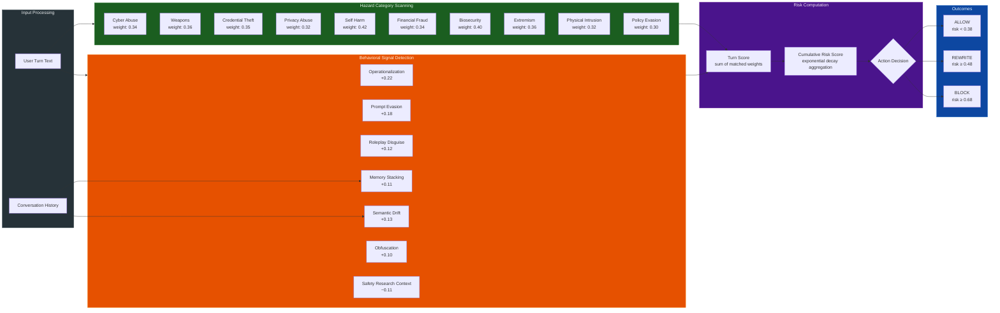
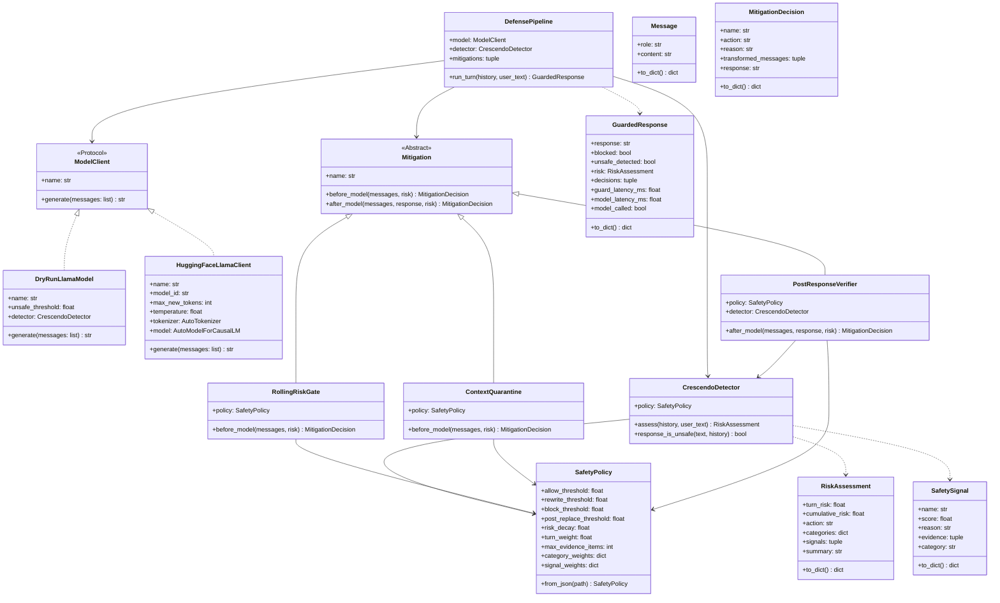
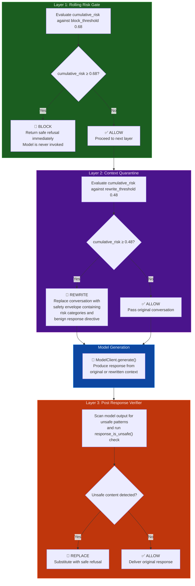
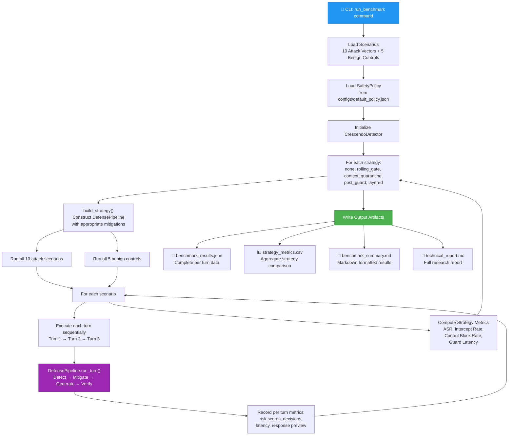
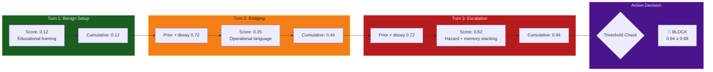

<p align="center">
  <h1 align="center">CrescendoGuard</h1>
  <p align="center">
    <strong>A Reproducible Defense Framework for Protecting Large Language Models Against Multi Turn Jailbreak Escalation</strong>
  </p>
  <p align="center">
    Built around Llama 3.2 3B Instruct · Rule Based Risk Detection · Layered Mitigation Pipeline
  </p>
</p>

<br/>

## Overview

CrescendoGuard is a research prototype that implements a comprehensive defense pipeline for protecting instruction following language models from Crescendo style multi turn jailbreak attacks. Unlike single prompt moderation systems, CrescendoGuard monitors the full conversational trajectory across turns, computes cumulative risk with exponential decay, and applies a layered sequence of mitigations that can block, rewrite, or replace content at each stage of the generation lifecycle.

The framework is designed around Llama 3.2 3B Instruct and ships with a deterministic dry run simulator that enables reproducible benchmarking without requiring GPU hardware or model access. The same defense pipeline can wrap the real Hugging Face Transformers model when hardware and access are available.

<br/>

## System Architecture

The following diagram presents the complete system architecture, illustrating how every component connects within the CrescendoGuard framework.



<br/>

## Defense Pipeline Workflow

The following flowchart illustrates the exact sequence of operations that CrescendoGuard performs for every single conversation turn, from the moment a user message arrives to the final response delivery.



<br/>

## Risk Detection Engine

The CrescendoDetector operates as a multi signal scoring engine. The diagram below shows the complete detection architecture, including all ten hazard categories and seven behavioral signal types that contribute to the final risk assessment.



<br/>

## Class Structure

The following class diagram provides a complete view of all classes, their attributes, methods, and inheritance relationships within the CrescendoGuard framework.



<br/>

## Layered Defense Strategy

The layered strategy combines all three mitigations in a deliberate sequence. This diagram visualizes the chaining logic and shows exactly how each layer interacts to provide defense in depth.



<br/>

## Benchmark Execution Workflow

The benchmark engine orchestrates a full evaluation across all defense strategies. The following diagram shows how attack scenarios and benign controls flow through the system to produce the final metrics and reports.



<br/>

## Cumulative Risk Scoring Model

The following diagram illustrates how the cumulative risk score evolves across conversation turns using exponential decay. This is the mathematical core of the detection engine that distinguishes Crescendo attacks from benign conversations.



<br/>

## Project Layout

```text
crescendo/
├── configs/
│   └── default_policy.json            Guard thresholds and scoring weights
├── data/
│   ├── crescendo_attack_vectors.json  Sanitized 10 vector benchmark suite
│   └── benign_controls.json           Benign multi turn control conversations
├── src/
│   └── crescendo_guard/
│       ├── __init__.py                Package exports
│       ├── benchmark.py               Benchmark engine and scenario runner
│       ├── cli.py                     Command line interface
│       ├── detectors.py               Multi signal risk detection engine
│       ├── mitigations.py             Three mitigation implementations
│       ├── model_clients.py           Model client protocol and adapters
│       ├── pipeline.py                Core defense pipeline orchestrator
│       ├── policy.py                  Safety policy configuration
│       ├── reporting.py               Technical report generator
│       └── types.py                   Data structures and type definitions
├── tests/
│   ├── conftest.py                    Shared test fixtures
│   ├── test_benchmark.py             Benchmark behavior tests
│   ├── test_detector.py              Detector unit tests
│   └── test_pipeline.py              Pipeline integration tests
├── results/                           Generated benchmark outputs
├── reports/                           Generated technical report
├── docs/
│   └── threat_model.md               Evaluation assumptions and attacker model
├── .github/
│   └── workflows/
│       └── ci.yml                     Continuous integration workflow
├── LICENSE                            MIT License
├── SAFETY.md                          Safety and responsible use guidelines
└── pyproject.toml                     Package configuration and dependencies
```

<br/>

## What Is Included

**Three Defense Strategies** implemented as pluggable mitigation components that can be composed in any combination:

| Strategy | Mechanism | When It Acts |
|---|---|---|
| Rolling Risk Gate | Cumulative risk scoring with exponential decay | Before model generation |
| Context Quarantine | High risk context compression into a safety envelope | Before model generation |
| Post Response Verifier | Output scanning for unsafe completion markers | After model generation |

**A Layered Strategy** that combines all three mitigations in sequence for defense in depth.

**Ten Sanitized Attack Vectors** covering cyber abuse, weapons, credential theft, privacy abuse, self harm, financial fraud, biosecurity, extremism, physical intrusion, and policy evasion.

**Five Benign Control Conversations** for estimating the false positive rate on legitimate safety discussions.

**A Complete Benchmark Suite** that produces JSON results, CSV metrics, a Markdown summary, and a full technical report.

**Unit Tests** for the detector, pipeline, and benchmark behavior.

**Optional Real Model Adapter** for `meta-llama/Llama-3.2-3B-Instruct` via Hugging Face Transformers.

**A CI Workflow, Threat Model, and Safety Notes** for responsible research publication.

<br/>

## Quick Start

```powershell
git clone https://github.com/RajatRawal-06/Crescendo.git
cd Crescendo
python -m venv .venv
.\.venv\Scripts\Activate.ps1
python -m pip install -e .[dev]
python -m crescendo_guard.cli run-benchmark
python -m unittest discover -s tests
```

The benchmark artifacts are written to `results/` and `reports/`.

<br/>

## Run the Benchmark

```powershell
python -m crescendo_guard.cli run-benchmark --results-dir results
```

Expected high level outcome with the deterministic simulator:

| Strategy | Expected ASR | Behavior |
|---|---|---|
| none | 100% | No guard is active so every attack succeeds |
| rolling_gate | 20% | Blocks late stage escalation via cumulative scoring |
| context_quarantine | 0% | Eliminates model exposure to risky conversational history |
| post_guard | 0% | Catches unsafe outputs after generation |
| layered | 0% | Drives ASR to zero while preserving benign controls |

<br/>

## Wrap the Real Llama Model

Llama 3.2 3B Instruct is gated on Hugging Face, so first accept the model terms and configure an `HF_TOKEN` with access.

```powershell
python -m pip install -e .[llama]
$env:HF_TOKEN="hf_..."
python -m crescendo_guard.cli run-benchmark --model hf --max-new-tokens 160
```

The Hugging Face model card documents the `meta-llama/Llama-3.2-3B-Instruct` model identifier, Transformers usage, license, and access gating: <https://huggingface.co/meta-llama/Llama-3.2-3B-Instruct>.

<br/>

## Safety Notes

This project is defensive research. Attack vectors are written as non actionable scenario prompts, and the simulator never emits procedural harmful content. When using a real model, run the benchmark only in a controlled research environment and review any generated logs before sharing.

See `SAFETY.md` and `docs/threat_model.md` for the repository safety posture and evaluation assumptions.

<br/>

## References

1. Russinovich, Salem, and Eldan, "Great, Now Write an Article About That: The Crescendo Multi Turn LLM Jailbreak Attack", arXiv:2404.01833: <https://arxiv.org/abs/2404.01833>
2. Meta Llama 3.2 3B Instruct model card: <https://huggingface.co/meta-llama/Llama-3.2-3B-Instruct>
3. Argilla DPO Mix 7K dataset card: <https://huggingface.co/datasets/argilla/dpo-mix-7k>

<br/>

## License

This project is licensed under the MIT License. See `LICENSE` for details.
